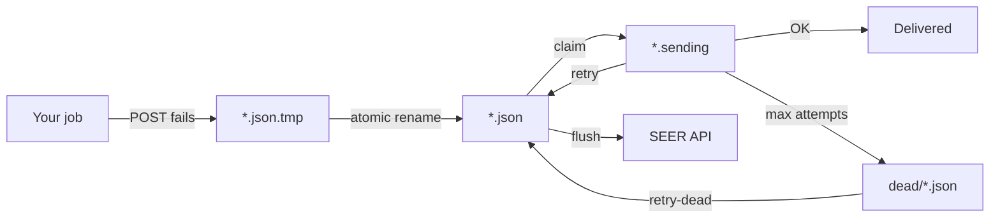

# SEER

**Offline-first job monitoring — not another ping service.**

Generic cron pings disappear when the network flaps, then fire false **missed / failed** alerts. **SEER** is different: it persists outcomes locally with atomic writes, keeps your process exit code intact, and delivers the real result when connectivity returns — no false positives from a blip.

**Cloud:** [seer.ansrstudio.com](https://seer.ansrstudio.com) — dashboard, API keys, pipelines, managed Webooks/email  
**This repo:** Python SDK · CLI · Community Edition self-host server (+ embedded ops UI)

```python
# One-liners that ship to production
with Seer(api_key=KEY, auto_replay=True).monitor("daily_etl"): run()          # Python
@app.task(base=SeerTask)                                                      # Celery
def etl(): ...
```

```bash
seer run daily_etl -- python etl.py   # any language via CLI
```

---

## Why not a generic ping?

| Generic “I’m alive” ping           | SEER                                            |
| ---------------------------------- | ----------------------------------------------- |
| Silence = failure (noisy)          | Silence = wait; outcome is queued               |
| Network flap → false alert         | Atomic offline queue → replay                   |
| Often drops mid-run context        | Full lifecycle: running → success/failed + logs |
| Monitoring outage can fail the job | Your exit code / exception always wins          |

---

## Atomic offline queue

When upload fails, SEER never leaves a half-written envelope on disk. Writers use temp + rename so readers only ever see complete JSON:

```text
  ~/.seer/queue/
       │
       │  1) write envelope to temp
       ▼
  job.json.<uuid>.tmp  ──os.replace / rename──►  job.json     (pending)
       │                                              │
       │                                              │  2) claim for send
       │                                              ▼
       │                                         job.json.sending
       │                                              │
       │                         success ─────────────┼──► delete
       │                         fail (retries left) ─┼──► job.json (attempts++)
       │                         fail (max attempts) ─┴──► dead/job.json
       │
  replay / seer queue flush / auto_replay / background_replay
       │
       ▼
  SEER Cloud (api.ansrstudio.com)  or  CE server (:8080)
```

Shared by **seerpy** and the **CLI**. Caps: `SEER_QUEUE_MAX_FILES` / `SEER_QUEUE_MAX_BYTES` (FIFO eviction). Inspect with `seer queue status` · `list-dead` · `retry-dead`.



---

## Instrument in seconds

**Python**

```python
from seerpy import Seer
seer = Seer(api_key="YOUR_KEY", auto_replay=True)  # cloud default host
with seer.monitor("daily_etl", capture_logs=True):
    run_pipeline()
```

**Celery** (`pip install seerpy[celery]`)

```python
from seerpy.integrations.celery import SeerTask, set_default_seer
set_default_seer(Seer(api_key="YOUR_KEY", auto_replay=True))

@app.task(base=SeerTask, seer_capture_logs=True)
def daily_etl():
    ...
```

**CLI — any runtime**

```bash
export SEER_API_KEY=your_key
seer run daily_etl -- python etl.py
seer run daily_etl -- node worker.js
seer heartbeat long_worker
seer queue status
```

Point at self-host with `SEER_BASE_URL=http://127.0.0.1:8080` (or `base_url=` in Python).

---

## Choose your path

### Hosted — [seer.ansrstudio.com](https://seer.ansrstudio.com)

1. Create an account and a pipeline name
2. Copy your API key
3. Use the SDK/CLI with the default API host (`https://api.ansrstudio.com`)

### Self-hosted Community Edition

```bash
cd server && export SEER_API_KEYS=dev-key && go run ./cmd/seer-server
# UI → http://localhost:8080/ui/login  (key: dev-key)
```

Jobs auto-create on first event. Generic webhook + SMTP, per-job notify flags, heartbeat miss checks, and `/ui` ship in one binary.

---

## Community vs Enterprise

|               | **Community** (this repo)           | **Enterprise / Cloud**                                       |
| ------------- | ----------------------------------- | ------------------------------------------------------------ |
| Agents        | seerpy + CLI, offline queue, Celery | Same agents against managed API                              |
| Ingest        | Self-host Go CE + SQLite            | Hosted at [seer.ansrstudio.com](https://seer.ansrstudio.com) |
| UI            | Embedded `/ui` ops console          | Full product dashboard                                       |
| Alerts        | Generic webhook + SMTP              | Managed channels + routing                                   |
| Auth / teams  | Shared API keys                     | RBAC, Okta / SSO                                             |
| Incident sync | —                                   | PagerDuty / Datadog (and more)                               |
| Compliance    | —                                   | SOC 2, VPC / private runners                                 |

CE `/enterprise/*` returns a stable **402** so clients can detect edition without bundling EE code.

---

## Monorepo

| Path                           | Package         | Role                                     |
| ------------------------------ | --------------- | ---------------------------------------- |
| [`sdks/python/`](sdks/python/) | **seerpy**      | SDK — monitor, heartbeats, queue, Celery |
| [`cli/`](cli/)                 | **seer**        | Wrap any command; `queue` diagnostics    |
| [`server/`](server/)           | **seer-server** | CE ingest + alerts + UI                  |

---

## Give to an agent

Paste into Cursor (or any coding agent) to stand up and verify the full local stack:

````markdown
# SEER local stack — agent runbook

Work in this monorepo. Start Community Edition, exercise CLI + Python against it, confirm UI. Do not commit unless asked.

## Prerequisites

- Go 1.22+, Python 3.10+
- Repo root contains `cli/`, `sdks/python/`, `server/`

## 1) Start CE server (background)

```powershell
cd server
$env:SEER_API_KEYS = "dev-key"
$env:SEER_DB_PATH = "$(Get-Location)\data\agent-seer.db"
$env:SEER_HTTP_ADDR = ":8080"
$env:SEER_NOTIFY_ON_FAILURE = "true"
go run ./cmd/seer-server
```

Wait for listen/UI logs. Check: `Invoke-RestMethod http://127.0.0.1:8080/health`

## 2) CLI jobs

```powershell
cd cli
go build -o seer.exe .
$env:SEER_API_KEY = "dev-key"
$env:SEER_BASE_URL = "http://127.0.0.1:8080"
$env:SEER_REPLAY_JITTER_MS = "0"
$env:SEER_QUEUE_DIR = "$env:TEMP\seer-agent-queue"
New-Item -ItemType Directory -Force -Path $env:SEER_QUEUE_DIR | Out-Null
.\seer.exe run agent_etl --tags=agent -- powershell -NoProfile -Command "Write-Host ok; exit 0"
.\seer.exe run agent_fail --tags=agent -- powershell -NoProfile -Command "Write-Host boom; exit 1"
.\seer.exe heartbeat agent_worker --metadata='{\"tick\":1}'
.\seer.exe queue status
```

## 3) Python + tests

```powershell
cd sdks/python
pip install -e ".[dev,celery]" -q
$env:SEER_API_KEY = "dev-key"
$env:SEER_BASE_URL = "http://127.0.0.1:8080"
$env:SEER_REPLAY_JITTER_MS = "0"
python -c "from seerpy import Seer; s=Seer(api_key='dev-key', base_url='http://127.0.0.1:8080', auto_replay=True)
with s.monitor('agent_py', capture_logs=True):
    print('hello from seerpy')"
python -m pytest tests/ -q
```

## 4) Server tests

```powershell
cd server
go test ./...
```

## 5) UI

Open http://127.0.0.1:8080/ui/login — key `dev-key`. Confirm demo jobs/runs.

## Cloud

https://seer.ansrstudio.com — use dashboard API key; omit SEER_BASE_URL (defaults to https://api.ansrstudio.com). Cloud jobs must exist in the dashboard; CE auto-creates.

## Success

- health ok · CLI exit codes preserved · pytest + `go test` green · UI shows jobs
````

---

## CI

- `python-sdk.yml` — test + PyPI (`sdks/python`)
- `cli.yml` — Go test + binaries (`cli`)
- `server.yml` — Go test/build + GHCR (`server`)

---

## License

[MIT](LICENSE) © Ansr Studio
